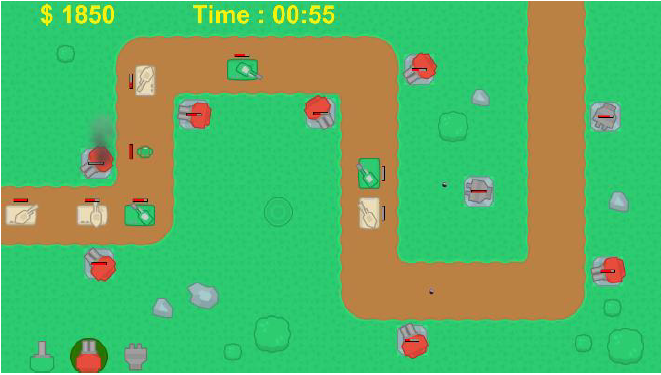
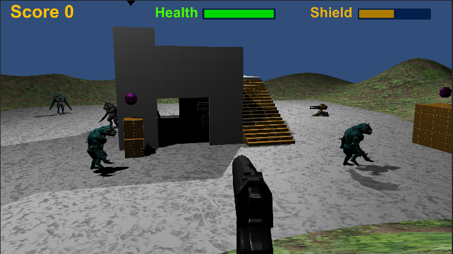

# Unity
Forløb brugt til Coding Pirates

## 2dplatform_guide.pdf [5-20 timer]  
  

Unity guide på dansk som beskriver hvordan man laver et 2D platform spil. Kræver ingen kendskab til Unity.  
Guiden indeholder også en lille reference manual.
* 2dplatform.unitypackage (brugt i guiden)  
* 2dplatform_final.zip (fuld løsning)  

Spilbar demo med extra features: https://play.unity.com/mg/other/webgl-builds-196616

## basket_guide.pdf [1-2 timer]  

Unity tutorial på dansk som beskriver hvordan man laver et simpelt 2D basketball spil. Kræver ingen kendskab til Unity.  
* basket_start_pakke.unitypackage (brugt i guiden)  
* basket_final.zip (fuld løsning)

## super_slingshot_guide.pdf [1-2 timer]  

Unity tutorial på dansk som beskriver hvordan man laver et simpel Angry Birds klon spil. Kræver ingen kendskab til Unity.  
* super_slingshot.unitypackage (brugt i guiden)  

Spilbar version: https://play.unity.com/mg/other/webgl-builds-317184

## tower_defense_guide.pdf [5-15 timer]  

Unity guide på dansk som beskriver hvordan man laver et simpelt Tower Defense spil.
Det er en forudsætning at man har lidt kendskab til Unity som svarer til at man har lavet unity-intro spillet. Man skal selv skrive lidt kode i C#.  
* tower_defense.unitypackage (brugt i guiden)  

Spilbar version: https://play.unity.com/mg/other/webgl-builds-198375  

## 3d_ball_endless.pdf [5-15 timer]

Unity guide på dansk som beskriver hvordan man laver et 3D ball endless spil.
Det er en forudsætning at man har kendskab til Unity og at man kan programmere lidt i C#.

Spilbar version: https://play.unity.com/mg/other/webgl-builds-356092

## fps_guide.pdf [5-? timer]  

Unity guide på dansk som beskriver hvordan man laver et simpelt 3D FPS spil.  
Det er en forudsætning at man kan skrive noget C# kode, kan finde rundt i Unity GUI'en og er klar til at kæmpe lidt for at få det til at virke.  
Alle filer som skal bruges skal hentes fra nettet (beskrevet i dokumentet).  
Spilbar version: https://play.unity.com/mg/other/webgl-builds-209446
  
---    
https://discord.gg/Qc67b6ZQ5V
